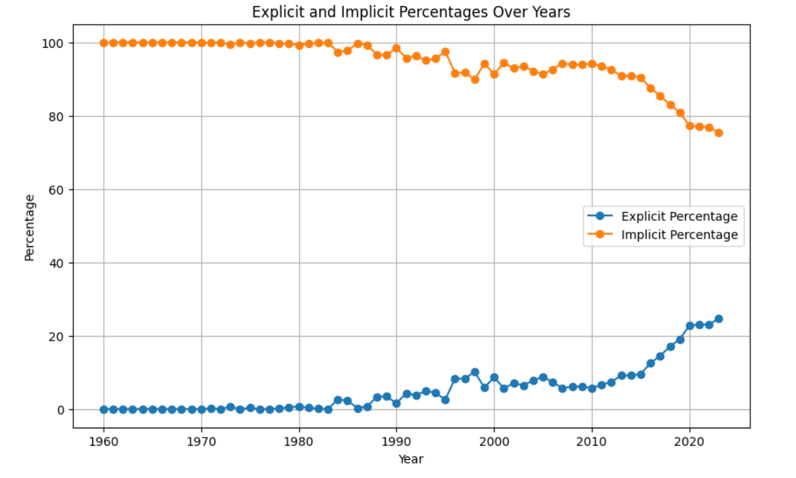

## To convert string to array type for genres
```
db.artists.find().forEach(function(doc) {
  var genresArray = doc.artist_genres.replace('[', '').replace(']', '').split(', ').map(function(item) {
    return item.replace(/'/g, '').trim();
  });

  db.artists.update(
    { "_id": doc._id },
    { "$set": { "artist_genres": genresArray } }
  );
}); 
```


## Query 1
#### Query: Style the top 10 artists with the highest average album popularity
```
db.albums.aggregate([
  {
    $match: {
      album_type: "album"
    }
  },
  {
    $group: {
      _id: "$artist_id",
      averageAlbumPopularity: { $avg: "$album_popularity" }
    }
  },
  {
    $lookup: {
      from: "artists",
      localField: "_id",
      foreignField: "id",
      as: "artistInfo"
    }
  },
  {
    $unwind: "$artistInfo"
  },
  {
    $project: {
      _id: 0,
      artist_id: "$_id",
      artist_name: "$artistInfo.name",
      averageAlbumPopularity: 1
    }
  },
  {
    $sort: {
      averageAlbumPopularity: -1
    }
  },
  {
    $limit: 10
  }
])
```
#### Result: 
```
{
  averageAlbumPopularity: 90,
  artist_name: 'Mitski'
}
{
  averageAlbumPopularity: 89.33962264150944,
  artist_name: 'Bad Bunny'
}
{
  averageAlbumPopularity: 88.11428571428571,
  artist_name: 'Harry Styles'
}
{
  averageAlbumPopularity: 86,
  artist_name: 'Troye Sivan'
}
{
  averageAlbumPopularity: 85,
  artist_name: 'Metro Boomin'
}
{
  averageAlbumPopularity: 84.72340425531915,
  artist_name: 'Imagine Dragons'
}
{
  averageAlbumPopularity: 84,
  artist_name: 'Olivia Rodrigo'
}
{
  averageAlbumPopularity: 84,
  artist_name: 'Zé Neto & Cristiano'
}
{
  averageAlbumPopularity: 82,
  artist_name: 'Paulo Londra'
}
{
  averageAlbumPopularity: 82,
  artist_name: 'Offset'
}
```
#### Interpreation: 


## Query 2
#### Query: Evolution of song's explicitness over the years (from 1960 on)
Indexes were created to speed up a such heavy query
```
db.tracks.createIndex({ "id": 1 })
db.features.createIndex({ "id": 1 })
db.albums.createIndex({ "track_id": 1 })
db.albums.createIndex({ "release_date": 1 })
```

To check that indexes were actually used, after the aggregate operation:
```
.explain("executionStats");
```
And the debug was successful. Without indexes the result couldn't be observed due to the long execution time needed.
```
db.tracks.aggregate([
  {
    $lookup: {
      from: "features",
      localField: "id",
      foreignField: "id",
      as: "track_features"
    }
  },
  {
    $unwind: "$track_features"
  },
  {
    $lookup: {
      from: "albums",
      localField: "id", 
      foreignField: "track_id",
      as: "album_info"
    }
  },
  {
    $unwind: "$album_info"
  },
  {
    $match: {
      "album_info.release_date": { $gte: ISODate("1960-01-01T00:00:00.000Z") }
    }
  },
  {
    $group: {
      _id: {
        year: { $year: "$album_info.release_date" },
        explicit: "$explicit"
      },
      totalTracks: { $sum: 1 }
    }
  },
  {
    $group: {
      _id: "$_id.year",
      explicitCount: {
        $sum: { $cond: [{ $eq: ["$_id.explicit", true] }, "$totalTracks", 0] }
      },
      implicitCount: {
        $sum: { $cond: [{ $eq: ["$_id.explicit", false] }, "$totalTracks", 0] }
      },
      totalTracks: { $sum: "$totalTracks" }
    }
  },
  {
    $project: {
      _id: 0,
      year: "$_id",
      explicitPercentage: {
        $multiply: [
          { $divide: ["$explicitCount", "$totalTracks"] },
          100
        ]
      },
      implicitPercentage: {
        $multiply: [
          { $divide: ["$implicitCount", "$totalTracks"] },
          100
        ]
      }
    }
  },
  {
    $sort: { year: 1 } 
  }
])

```
#### Result: 
A (very long) result is shown to prove the correctness of the query. A better view can be seen with the plot showing the trend of explicitness increase in the last decades.
```
[{
    "year": 1960,
  "explicitPercentage": 0,
  "implicitPercentage": 100
},
{
    "year": 1961,
  "explicitPercentage": 0,
  "implicitPercentage": 100
},
{
 
  "year": 1962,
  "explicitPercentage": 0,
  "implicitPercentage": 100
},
{
    "year": 1963,
  "explicitPercentage": 0,
  "implicitPercentage": 100
},
{
    "year": 1964,
  "explicitPercentage": 0,
  "implicitPercentage": 100
},
{
    "year": 1965,
  "explicitPercentage": 0,
  "implicitPercentage": 100
},
{
    "year": 1966,
  "explicitPercentage": 0,
  "implicitPercentage": 100
},
{
    "year": 1967,
  "explicitPercentage": 0,
  "implicitPercentage": 100
},
{
    "year": 1968,
  "explicitPercentage": 0,
  "implicitPercentage": 100
},
{
 
  "year": 1969,
  "explicitPercentage": 0,
  "implicitPercentage": 100
},
{
    "year": 1970,
  "explicitPercentage": 0,
  "implicitPercentage": 100
},
{
 
  "year": 1971,
  "explicitPercentage": 0.16260162601626016,
  "implicitPercentage": 99.83739837398375
},
{
 
  "year": 1972,
  "explicitPercentage": 0,
  "implicitPercentage": 100
},
{
    "year": 1973,
  "explicitPercentage": 0.6201550387596899,
  "implicitPercentage": 99.37984496124031
},
{
    "year": 1974,
  "explicitPercentage": 0,
  "implicitPercentage": 100
},
{
    "year": 1975,
  "explicitPercentage": 0.2958579881656805,
  "implicitPercentage": 99.70414201183432
},
{
 
  "year": 1976,
  "explicitPercentage": 0,
  "implicitPercentage": 100
},
{
    "year": 1977,
  "explicitPercentage": 0,
  "implicitPercentage": 100
},
{
    "year": 1978,
  "explicitPercentage": 0.19880715705765406,
  "implicitPercentage": 99.80119284294234
},
{
    "year": 1979,
  "explicitPercentage": 0.42194092827004215,
  "implicitPercentage": 99.57805907172997
},
{
    "year": 1980,
  "explicitPercentage": 0.7334963325183375,
  "implicitPercentage": 99.26650366748166
},
{
 
  "year": 1981,
  "explicitPercentage": 0.33167495854063017,
  "implicitPercentage": 99.66832504145937
},
{
,
  "year": 1982,
  "explicitPercentage": 0.1303780964797914,
  "implicitPercentage": 99.86962190352021
},
{

  "year": 1983,
  "explicitPercentage": 0,
  "implicitPercentage": 100
},
{

  "year": 1984,
  "explicitPercentage": 2.635431918008785,
  "implicitPercentage": 97.36456808199122
},
{

  "year": 1985,
  "explicitPercentage": 2.2530329289428077,
  "implicitPercentage": 97.74696707105718
},
{

  "year": 1986,
  "explicitPercentage": 0.2638522427440633,
  "implicitPercentage": 99.73614775725594
},
{

  "year": 1987,
  "explicitPercentage": 0.7035175879396985,
  "implicitPercentage": 99.2964824120603
},
{

  "year": 1988,
  "explicitPercentage": 3.329369797859691,
  "implicitPercentage": 96.6706302021403
},
{

  "year": 1989,
  "explicitPercentage": 3.423236514522822,
  "implicitPercentage": 96.57676348547717
},
{

  "year": 1990,
  "explicitPercentage": 1.5527950310559007,
  "implicitPercentage": 98.4472049689441
},
{

  "year": 1991,
  "explicitPercentage": 4.265997490589712,
  "implicitPercentage": 95.73400250941029
},
{

  "year": 1992,
  "explicitPercentage": 3.720405862457723,
  "implicitPercentage": 96.27959413754228
},
{

  "year": 1993,
  "explicitPercentage": 4.915992532669571,
  "implicitPercentage": 95.08400746733044
},
{

  "year": 1994,
  "explicitPercentage": 4.438860971524288,
  "implicitPercentage": 95.56113902847572
},
{

  "year": 1995,
  "explicitPercentage": 2.535211267605634,
  "implicitPercentage": 97.46478873239437
},
{

  "year": 1996,
  "explicitPercentage": 8.294693456980937,
  "implicitPercentage": 91.70530654301906
},
{

  "year": 1997,
  "explicitPercentage": 8.265342319971621,
  "implicitPercentage": 91.73465768002838
},
{

  "year": 1998,
  "explicitPercentage": 10.131826741996234,
  "implicitPercentage": 89.86817325800376
},
{

  "year": 1999,
  "explicitPercentage": 5.842575060860157,
  "implicitPercentage": 94.15742493913984
},
{

  "year": 2000,
  "explicitPercentage": 8.64406779661017,
  "implicitPercentage": 91.35593220338983
},
{

  "year": 2001,
  "explicitPercentage": 5.629669156883671,
  "implicitPercentage": 94.37033084311632
},
{

  "year": 2002,
  "explicitPercentage": 7.041587901701324,
  "implicitPercentage": 92.95841209829868
},
{

  "year": 2003,
  "explicitPercentage": 6.454047933572372,
  "implicitPercentage": 93.54595206642763
},
{

  "year": 2004,
  "explicitPercentage": 7.8275134755097255,
  "implicitPercentage": 92.17248652449027
},
{

  "year": 2005,
  "explicitPercentage": 8.721965112139552,
  "implicitPercentage": 91.27803488786044
},
{

  "year": 2006,
  "explicitPercentage": 7.350402761795167,
  "implicitPercentage": 92.64959723820483
},
{

  "year": 2007,
  "explicitPercentage": 5.678690424453137,
  "implicitPercentage": 94.32130957554686
},
{

  "year": 2008,
  "explicitPercentage": 6.11358574610245,
  "implicitPercentage": 93.88641425389756
},
{

  "year": 2009,
  "explicitPercentage": 6.075922142165824,
  "implicitPercentage": 93.92407785783418
},
{
  "year": 2010,
  "explicitPercentage": 5.746697514739906,
  "implicitPercentage": 94.2533024852601
},
{
  "year": 2011,
  "explicitPercentage": 6.576110392410523,
  "implicitPercentage": 93.42388960758949
},
{
  "year": 2012,
  "explicitPercentage": 7.42041333256577,
  "implicitPercentage": 92.57958666743423
},
{
  "year": 2013,
  "explicitPercentage": 9.112736612876207,
  "implicitPercentage": 90.8872633871238
},
{
  "year": 2014,
  "explicitPercentage": 9.137893116340443,
  "implicitPercentage": 90.86210688365955
},
{
  "year": 2015,
  "explicitPercentage": 9.559696178495134,
  "implicitPercentage": 90.44030382150487
},
{
  "year": 2016,
  "explicitPercentage": 12.438013721893892,
  "implicitPercentage": 87.5619862781061
},
{
  "year": 2017,
  "explicitPercentage": 14.558927695744565,
  "implicitPercentage": 85.44107230425544
},
{
  "year": 2018,
  "explicitPercentage": 16.986899563318776,
  "implicitPercentage": 83.01310043668121
},
{
  "year": 2019,
  "explicitPercentage": 19.069621388839046,
  "implicitPercentage": 80.93037861116096
},
{
  "year": 2020,
  "explicitPercentage": 22.754130842444184,
  "implicitPercentage": 77.24586915755582
},
{
  "year": 2021,
  "explicitPercentage": 22.987689393939394,
  "implicitPercentage": 77.01231060606061
},
{
  "year": 2022,
  "explicitPercentage": 23.10514041395394,
  "implicitPercentage": 76.89485958604607
},
{
  "year": 2023,
  "explicitPercentage": 24.6222538083614,
  "implicitPercentage": 75.3777461916386
}]
```


#### Interpreation: 

